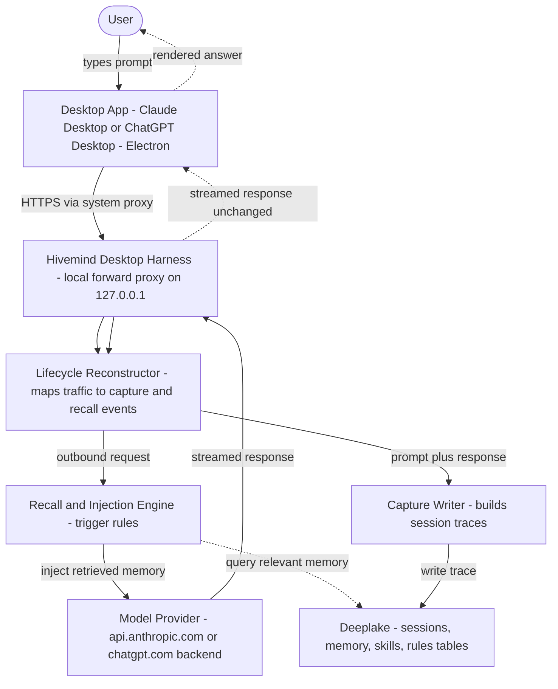

# Desktop Memory Harness Overview

> Category: Architecture | Version: 1.0 | Date: June 2026 | Status: Draft

For platform engineers and AI agents: how Hivemind reaches the two desktop chat
apps (Claude Desktop and ChatGPT Desktop) that have no hook system, no extension
API, and no MCP guarantee. The harness borrows the localhost interception design
from the `rflectr` Cursor SDK shim and reuses Hivemind's existing capture, recall,
and Deeplake pipeline unchanged.

**Related:**
- [`../integrations/desktop-app-interception.md`](../integrations/desktop-app-interception.md)
- [`../security/desktop-egress-and-trust.md`](../security/desktop-egress-and-trust.md)
- [`../plugins/integration-model.md`](../plugins/integration-model.md)
- [`../plugins/hook-lifecycle.md`](../plugins/hook-lifecycle.md)
- [`../ai/session-capture.md`](../ai/session-capture.md)
- [`../../../requirements/backlog/prd-006-desktop-memory-harness/prd-006-desktop-memory-harness-index.md`](../../../requirements/backlog/prd-006-desktop-memory-harness/prd-006-desktop-memory-harness-index.md)

---

## Section 1 - Why the desktop apps are different

Every harness Hivemind ships today attaches through a host-provided extension
point. Claude Code has a marketplace plugin, Codex and Cursor expose
`hooks.json`, OpenClaw has a native extension, Hermes has shell hooks plus an MCP
server, and pi has its extension API. In every case the host fires a lifecycle
event (`SessionStart`, `UserPromptSubmit`, `PostToolUse`, `Stop`, `SessionEnd`)
and Hivemind runs code in response. See
[`../plugins/integration-model.md`](../plugins/integration-model.md).

Claude Desktop and ChatGPT Desktop give us none of that. They are sealed Electron
chat clients. There is no documented hook surface, no first-party plugin API we
can wire capture into, and no way to register a `SessionEnd` callback. Claude
Desktop does speak MCP, but MCP is the wrong tool for memory, and the reason is
worth stating precisely because it drives the whole design.

### Why MCP is not enough on its own

MCP tools fire at the model's discretion. The model decides whether to call a
tool, when to call it, and with what arguments. A memory layer cannot run on
discretion. It needs two guarantees MCP structurally cannot give:

1. **Guaranteed capture.** Every prompt and every response must land in Deeplake,
   whether or not the model decides to call a "save this" tool. With MCP, capture
   only happens if the model chooses to invoke it, which means it mostly will not.
2. **Guaranteed recall and injection.** When a recall trigger fires (the user
   types "remember", or N messages have passed, or a project context is detected),
   the relevant memory must be injected into the outbound request deterministically.
   MCP gives the model a `hivemind_search` tool it may or may not reach for. It
   does not give us Cursor-style hooks ("on every prompt do X", "on keyword Y do Z").

The data path is the only place both guarantees hold. If we sit in the request and
response stream, capture and injection are deterministic and host-independent. That
is exactly what `rflectr` does for the Cursor SDK, and exactly what CrabTrap does
for arbitrary agents. MCP stays in the design as a secondary, user-driven surface
(explicit "search my memory" calls), not as the capture or injection mechanism.

---

## Section 2 - The borrowed spine: rflectr, adapted

`rflectr` is a localhost interception shim for the Cursor SDK. The SDK reads
`CURSOR_API_BASE_URL` and `CURSOR_BACKEND_URL`, so rflectr points those at a
loopback server, re-emits Cursor's wire protocol, routes inference through a
gateway, and enforces deny-by-default egress with an in-process undici dispatcher
plus a container NetworkPolicy.

Two things carry over directly and one thing must change.

**Carries over: the loopback interception model.** A local process owns the data
path between the app and the model provider. It observes every request and
response, and it is the deterministic point where capture and injection happen.

**Carries over: deny-by-default egress as a safety property.** rflectr's contract
("nothing phones home unless we allow it") becomes "the harness only ever talks to
the model provider and to Deeplake, and the user can see and prove that." See
[`../security/desktop-egress-and-trust.md`](../security/desktop-egress-and-trust.md).

**Must change: the attach mechanism.** rflectr flips an env var that an SDK
politely reads. The desktop apps do not read a base-URL env var we control. They
open their own TLS connections to `api.anthropic.com` and `chatgpt.com` from inside
Electron. To get into that path we use a local forward proxy with a trusted CA, the
CrabTrap transport model, rather than rflectr's env-var redirect. The interception
*logic* is rflectr's; the interception *transport* is CrabTrap's. Details and the
hard risk (TLS certificate pinning) are in
[`../integrations/desktop-app-interception.md`](../integrations/desktop-app-interception.md).

---

## Section 3 - System diagram

The harness is a man-in-the-middle on the app's own provider connection. On the
way out it can inject retrieved memory into the request; on the way back it
captures the exchange. The app receives the provider's response and never knows
the harness was there.

---

## Section 4 - Mapping intercepted traffic to Hivemind lifecycle events

Hivemind's pipeline is built around lifecycle events. The desktop harness has no
host to fire them, so it *reconstructs* them from the request and response stream.
This is the core conceptual move: the proxy is the hook system the desktop apps
never gave us.

| Hivemind event (other harnesses) | Desktop harness equivalent (reconstructed) |
|---|---|
| `SessionStart` | First intercepted request on a new app conversation id, or first request after an idle gap beyond the session-timeout |
| `UserPromptSubmit` | An outbound completion request carrying a new user turn. This is the injection point for recall. |
| `PostToolUse` | An outbound request whose latest message is a tool result (provider-native tool use), when present |
| `Stop` / `afterAgentResponse` | A completed response stream for a turn. This is the capture point. |
| `SessionEnd` | Conversation closed, or idle past the session-timeout. Triggers the existing wiki-summary worker. |

Once reconstructed, these events feed the **same** capture writer, recall query,
embedding, skillify, and wiki-summary code every other harness uses. The desktop
harness adds a front end (the proxy plus the reconstructor); it does not fork the
brain. See [`../ai/session-capture.md`](../ai/session-capture.md) and
[`../plugins/hook-lifecycle.md`](../plugins/hook-lifecycle.md).

---

## Section 5 - Two processes, one machine

Like rflectr's two-process container, the harness separates the interception path
from the memory path, for the same reasons (isolate failure, independent restart,
separate observability).

| Process | Responsibility | Network |
|---|---|---|
| **Proxy process** | Terminate TLS for the app's provider connection, expose the request/response stream, stream responses back unchanged, enforce the egress allowlist | Inbound from the app over loopback; outbound to the model provider only |
| **Memory worker** | Reconstruct lifecycle events, run recall queries, write captures to Deeplake, run embeddings and the wiki-summary worker at session end | Outbound to Deeplake (`api.deeplake.ai`) only |

The proxy never writes to Deeplake and the worker never sits in the user's
latency path for the model response. Injection is the one place the proxy must
block briefly on the worker (a recall query), and that path has a hard timeout so
a slow or unreachable Deeplake degrades to "no memory injected", never "the app
hangs". This mirrors rflectr's failure-mode contract: the memory layer failing must
never break the user's chat.

---

## Section 6 - Per-OS reality (macOS and Windows)

This harness targets macOS and Windows desktop apps. There is no Linux target and
no container; rflectr's Kubernetes NetworkPolicy layer does not apply. Egress
enforcement is in-process only (the allowlist dispatcher), plus optional OS-level
controls documented in the security doc.

| Concern | macOS | Windows |
|---|---|---|
| Make the app use our proxy | System HTTP/HTTPS proxy (Network settings / `networksetup`), or per-app proxy env if the app honors it | System proxy (WinINET / `netsh winhttp`), or per-app proxy env if honored |
| Trust the harness CA | Add to login keychain, trust for SSL | Add to the user's Trusted Root store |
| The blocking risk | TLS certificate pinning by the app | Same |
| Install surface | `hivemind claude-desktop install` / `hivemind gpt-desktop install` | Same commands, OS-specific wiring |

Whether each app honors the system proxy and whether it pins certificates is the
make-or-break question, and it must be answered empirically per app per OS before
any build. That spike is Phase 0 of
[`../../../requirements/backlog/prd-006-desktop-memory-harness/prd-006-desktop-memory-harness-index.md`](../../../requirements/backlog/prd-006-desktop-memory-harness/prd-006-desktop-memory-harness-index.md).

---

## Section 7 - What stays out of scope

- **LittleBird.** Dropped from this round. The harness targets Claude Desktop and
  ChatGPT Desktop only.
- **Re-routing inference.** rflectr re-points models at a gateway. This harness is
  a memory layer, not a routing layer. It forwards to the app's real provider
  untouched except for memory injection. Re-routing is a separate decision recorded
  in [`prd-006e`](../../../requirements/backlog/prd-006-desktop-memory-harness/prd-006e-open-decisions.md).
- **Forking the memory pipeline.** Capture, embeddings, skillify, wiki summaries,
  and the Deeplake schema are reused as-is. New schema is not expected; if it is,
  it goes through the schema-healing path in
  [`../data/deeplake-tables-schema.md`](../data/deeplake-tables-schema.md).

---

## Section 8 - Open questions

Tracked in full in
[`prd-006e-open-decisions`](../../../requirements/backlog/prd-006-desktop-memory-harness/prd-006e-open-decisions.md).
The three that gate everything:

1. Does each app honor a system or per-app proxy, and does it pin its provider
   certificate? If an app pins, the forward-proxy transport does not work for it
   and we need a fallback (MCP-only for Claude Desktop, or a different injection
   surface).
2. What is the privacy and terms posture of a local proxy that reads a user's own
   Anthropic and OpenAI traffic on their own machine, with their consent?
3. Is provider-side prompt injection (modifying the outbound request to add memory)
   acceptable, or should recall be surfaced to the user some other way?
