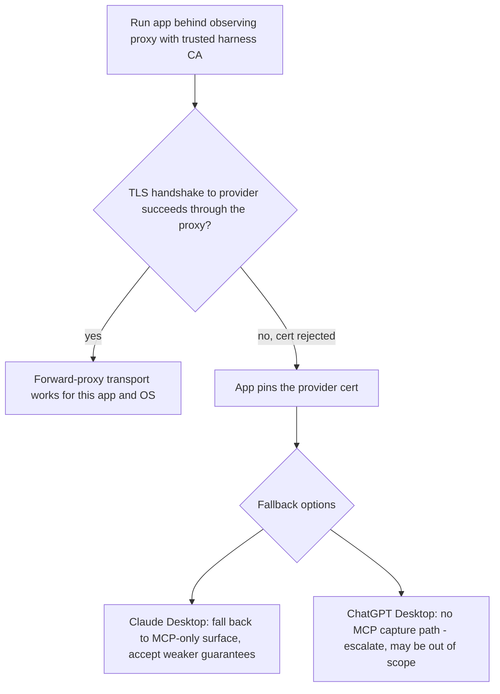

# Desktop App Interception

> Category: Integration | Version: 1.0 | Date: June 2026 | Status: Draft

For harness engineers: exactly how the Hivemind desktop harness gets into the
request and response path of Claude Desktop and ChatGPT Desktop, what each app
talks to, the certificate-pinning risk that decides whether this works at all, and
the per-OS proxy and CA wiring. This is the desktop equivalent of rflectr's
`cursor-sdk-internals.md`, and it must be filled in from empirical observation, not
assumption.

**Related:**
- [`../architecture/desktop-harness-overview.md`](../architecture/desktop-harness-overview.md)
- [`../security/desktop-egress-and-trust.md`](../security/desktop-egress-and-trust.md)
- [`../../../requirements/backlog/prd-006-desktop-memory-harness/prd-006a-interception-proxy.md`](../../../requirements/backlog/prd-006-desktop-memory-harness/prd-006a-interception-proxy.md)
- [`../../../requirements/backlog/prd-006-desktop-memory-harness/prd-006b-capture-lifecycle.md`](../../../requirements/backlog/prd-006-desktop-memory-harness/prd-006b-capture-lifecycle.md)

---

## Section 1 - Methodology (fill from observation, like rflectr)

rflectr derived the Cursor SDK's network behavior exclusively from runtime
inspection, never from decompiled source, and re-ran that inspection on every
version bump. The desktop harness uses the same discipline: every hostname,
endpoint, wire format, and pinning behavior in this document is to be confirmed by
running the real app behind an observing proxy on a real machine, per app, per OS,
and re-confirmed when the app updates.

The Phase 0 spike (see the PRD index) produces the first version of the tables
below. Until a row is empirically confirmed, it is marked `UNVERIFIED` and no code
depends on it.

---

## Section 2 - What we know going in

| App | Shipped as | Speaks MCP | Memory-relevant transport |
|---|---|---|---|
| **Claude Desktop** | Electron app (macOS, Windows) | Yes (native MCP client) | HTTPS to Anthropic's API/backend for chat completions |
| **ChatGPT Desktop** | Electron app (macOS, Windows) | Not as a general MCP client we can rely on for capture | HTTPS to OpenAI's ChatGPT backend |

Because both are Electron, two things are generally true and both must still be
verified per app:

- Electron's network stack is Chromium's. Chromium honors the OS proxy
  configuration by default, which is the hook we want for the forward-proxy
  transport.
- Chromium validates TLS against the OS trust store by default, which is why a
  user-installed CA is normally enough to terminate TLS. The exception that breaks
  this is application-level certificate pinning, covered in Section 4.

---

## Section 3 - Endpoint tables (to be confirmed in Phase 0)

### Claude Desktop

| Host | Purpose | Disposition | Status |
|---|---|---|---|
| `api.anthropic.com` | Chat completions (Messages API wire format) | Intercept: capture + inject | UNVERIFIED |
| Anthropic auth/session host(s) | Login, session refresh | Forward untouched | UNVERIFIED |
| Telemetry / analytics host(s) | Usage events | Forward or allow; not captured | UNVERIFIED |

### ChatGPT Desktop

| Host | Purpose | Disposition | Status |
|---|---|---|---|
| `chatgpt.com` backend (conversation endpoint) | Chat turns (ChatGPT backend wire format, not the public OpenAI API shape) | Intercept: capture + inject | UNVERIFIED |
| Auth host(s) | Login, token refresh | Forward untouched | UNVERIFIED |
| Telemetry / analytics host(s) | Usage events | Forward or allow; not captured | UNVERIFIED |

Note the ChatGPT desktop app talks to the consumer ChatGPT backend, whose
request/response shape is not the documented `api.openai.com` Chat Completions
schema. The capture and injection adapter for ChatGPT must be written against what
the app actually sends, captured in Phase 0, not against the public API docs. The
Anthropic Messages API shape is closer to public, but still verify.

---

## Section 4 - The pinning question (this decides the project)

A forward proxy with a trusted CA only works if the app validates TLS against the
OS trust store. If an app **pins** its provider certificate (ships the expected
cert or public key and rejects anything else, including a user-trusted CA), the
proxy cannot terminate that connection and interception via this transport fails
for that app.

This is the single highest risk in the whole harness. It must be answered first.

Possible outcomes per app per OS:

1. **Honors proxy, no pinning.** Best case. The forward-proxy transport works; the
   harness proceeds as designed.
2. **Honors proxy, pins the provider cert.** The proxy sees the connection attempt
   but cannot read it. For Claude Desktop, fall back to the MCP surface and accept
   that capture/injection become best-effort, not guaranteed. For ChatGPT Desktop,
   there is no comparable fallback, so the app may be out of scope until another
   surface exists.
3. **Ignores the system proxy entirely.** Then we need a per-app proxy setting or
   an Electron flag the app respects, or the app is out of scope for this transport.

Do not write the capture or injection adapters until Section 3 and this section are
green for at least one app on one OS.

---

## Section 5 - Per-OS proxy and CA wiring

The harness binds a local proxy on `127.0.0.1` at an ephemeral port (rflectr's
port-file pattern: bind `:0`, read the assigned port, write it where the installer
and app config can find it). It then makes the target app route through that port
and trust the harness CA.

### macOS

- **Proxy:** set the HTTPS proxy for the active network service
  (`networksetup -setsecurewebproxy`), or a scoped per-app approach if the app
  honors `HTTPS_PROXY`. Prefer the narrowest scope that works so we do not reroute
  the user's entire machine.
- **CA trust:** generate a per-install CA, add it to the login keychain, and mark
  it trusted for SSL. The private key never leaves the machine and is stored with
  `0600` perms next to Hivemind's existing credentials.
- **Uninstall:** remove the proxy setting and delete the CA from the keychain.

### Windows

- **Proxy:** set the user-scope WinINET proxy, or `netsh winhttp set proxy` where
  appropriate, or a per-app environment proxy if honored. Same "narrowest scope"
  rule.
- **CA trust:** add the per-install CA to the current user's Trusted Root
  Certification Authorities store (user scope, not machine scope; no admin needed).
- **Uninstall:** revert the proxy setting and remove the CA from the user store.

Both flows are first-run consent gates. Installing a trusted root CA is a
significant action and the installer must explain it in plain language and require
explicit approval. See
[`../../../requirements/backlog/prd-006-desktop-memory-harness/prd-006d-installer-health-consent.md`](../../../requirements/backlog/prd-006-desktop-memory-harness/prd-006d-installer-health-consent.md).

---

## Section 6 - Streaming

Both apps stream responses (SSE-style token deltas). The proxy must stream the
response back to the app unchanged and in real time while teeing a copy to the
memory worker. It must never buffer the full response before forwarding, or the
user sees their chat stall. rflectr's `Run` streaming handler and CrabTrap's
pass-through streaming are the reference for this: forward first, capture from a
copy.

Injection happens on the **request** (before forward), which is fully buffered and
small. Capture happens on the **response** (after stream completes), assembled from
the teed copy. The two are independent, which keeps the latency-sensitive response
path free of any Deeplake dependency.

---

## Section 7 - Wire-format adapters

Each provider needs a small adapter that knows how to do two things against that
provider's request/response shape:

1. **Read** the latest user turn and the conversation id out of a request, and read
   the assembled assistant turn out of a response, so the capture writer can build a
   Hivemind session trace (the same trace shape every other harness produces; see
   [`../ai/session-capture.md`](../ai/session-capture.md)).
2. **Write** retrieved memory into the request in a way the provider accepts (for
   example, a system-level or context block prepended to the turn), without
   corrupting the app's own framing.

| Provider | Request shape | Response shape | Adapter status |
|---|---|---|---|
| Anthropic (Claude Desktop) | Messages API style | SSE deltas | UNVERIFIED |
| ChatGPT backend (ChatGPT Desktop) | ChatGPT backend conversation payload | SSE deltas | UNVERIFIED |

Adapters are versioned and snapshot-tested against captured real payloads, the same
way rflectr snapshots the Cursor protobuf schema on every SDK bump. When an app
updates and changes its payload shape, the snapshot diff catches it before the
adapter silently mis-parses.
