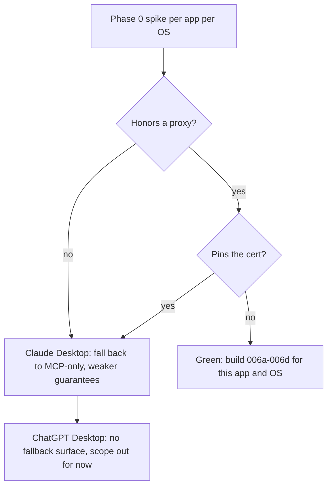

# PRD-006: Desktop Memory Harness (Claude Desktop and ChatGPT Desktop)

> **Status:** Backlog
> **Priority:** P1
> **Effort:** XL (> 3d)
> **Schema changes:** None expected (reuses `sessions`, `memory`, `skills`, `rules`)

---

## Overview

Hivemind reaches every supported assistant through a host-provided hook: a
marketplace plugin, `hooks.json`, a native extension, or an MCP server wired to
lifecycle events. Claude Desktop and ChatGPT Desktop give us none of that. They are
sealed Electron chat apps with no hook surface and no plugin API we can attach
capture to. Claude Desktop speaks MCP, but MCP fires at the model's discretion,
which cannot guarantee that every prompt is captured or that recalled memory is
injected on every turn. A memory layer needs both guarantees, and the only place
they hold is the data path.

PRD-006 delivers the **Desktop Memory Harness**: a local forward proxy that sits on
the app's own connection to its model provider, reconstructs Hivemind's lifecycle
events from the request and response stream, and feeds the existing capture, recall,
embedding, skillify, and wiki-summary pipeline unchanged. It borrows its
interception logic from the `rflectr` Cursor SDK shim and its transport (a local
proxy with a trusted CA) from the CrabTrap model. The result is the same
cross-device and team memory Hivemind already provides for coding agents, now for
the two desktop chat apps, on macOS and Windows.

This index covers the module vision, the architecture decision, and the five
sub-PRDs. Mechanics live in the sub-PRDs and in the three knowledge docs linked
under Related.

---

## The problem, from the user's chair

A user already runs Hivemind across their coding agents. Their senior engineer's
Claude Code session on Monday sharpens every agent on the team by Tuesday. Then the
same user opens Claude Desktop or ChatGPT Desktop to think through a design, debug a
gnarly problem, or draft a decision, and none of it is captured. That work is
invisible to the shared brain. The desktop chat apps are a hole in the memory.

The reason the hole exists is purely mechanical: there is no hook to attach to. This
PRD closes the hole by attaching to the data path instead of a hook.

---

## Why a proxy and not MCP

This is the central architecture decision, so it is stated once, here, plainly.

- **MCP is discretionary.** The model decides whether to call a tool. Capture that
  depends on the model deciding to save will mostly not happen. Injection that
  depends on the model deciding to search will mostly not happen.
- **A memory layer must be deterministic.** Every prompt captured, relevant memory
  injected on the turns that warrant it, driven by rules we control (on keyword
  "remember", every N turns, on detected project context), which is exactly the
  Cursor-style hook behavior the desktop apps do not expose.
- **The data path is the only deterministic surface.** A local proxy on the app's
  provider connection sees every request and response, with no reliance on model
  cooperation.

MCP stays as a secondary, user-driven surface for explicit "search my memory"
requests in Claude Desktop. It is not the capture or injection mechanism. Full
reasoning in
[`../../../knowledge/private/architecture/desktop-harness-overview.md`](../../../knowledge/private/architecture/desktop-harness-overview.md).

---

## Goals

- A user installs the harness for Claude Desktop or ChatGPT Desktop with one
  command and an explicit consent step, on macOS or Windows, and from then on their
  desktop chats are captured into Deeplake and benefit from recalled memory.
- Capture is deterministic: every user turn and model response on an intercepted
  conversation produces a Hivemind session trace identical in shape to what the
  other harnesses produce.
- Recall is deterministic and rule-driven: memory is injected into the outbound
  request when a trigger fires, with a hard timeout so a slow Deeplake never stalls
  the chat.
- The security posture is legible and provable: a tight egress allowlist, a
  leak-attempt log, no secret logging, per-install CA, and a one-click uninstall
  that removes the proxy and the CA.
- The memory pipeline is reused, not forked. No new Deeplake schema unless a spike
  proves one is unavoidable.

## Non-Goals

- **LittleBird.** Out of scope for this round. Claude Desktop and ChatGPT Desktop
  only.
- **Re-routing inference to a gateway.** rflectr re-points models at Portkey. This
  harness forwards to the app's real provider untouched except for memory injection.
  Routing is recorded as an open decision, not built here.
- **Linux / containers.** Targets are the macOS and Windows desktop apps. rflectr's
  NetworkPolicy layer does not apply.
- **A new memory model.** Capture, embeddings, skillify, wiki summaries, org and
  workspace scoping are reused as-is.
- **Defeating certificate pinning.** If an app pins its provider cert, this
  transport does not work for it and we fall back (MCP-only for Claude Desktop) or
  scope it out, rather than attempting to bypass pinning.

---

## Sub-features

| Sub-PRD | Scope | Status |
|---|---|---|
| [`prd-006a-interception-proxy`](./prd-006a-interception-proxy.md) | The local forward proxy: bind on loopback, terminate TLS with a per-install CA, stream responses through unchanged, enforce the egress allowlist, per-OS proxy and CA wiring. | Backlog |
| [`prd-006b-capture-lifecycle`](./prd-006b-capture-lifecycle.md) | Reconstruct Hivemind lifecycle events from intercepted traffic and write session traces via the existing capture path. Provider wire-format adapters for Anthropic and the ChatGPT backend. | Backlog |
| [`prd-006c-recall-and-hooks`](./prd-006c-recall-and-hooks.md) | The deterministic recall and injection engine: trigger rules (keyword, cadence, context), Deeplake query, inject into the outbound request within a hard timeout. | Backlog |
| [`prd-006d-installer-health-consent`](./prd-006d-installer-health-consent.md) | `hivemind claude-desktop install` / `gpt-desktop install`, consent for CA + proxy, health/status, capture toggle, clean uninstall. | Backlog |
| [`prd-006e-open-decisions`](./prd-006e-open-decisions.md) | The decisions that gate the build: pinning spike outcome, terms posture, injection acceptability, routing, OS firewall hardening. | Backlog |

---

## Phase 0 is a spike, not code

Unlike the other PRDs, PRD-006 cannot start with implementation. The forward-proxy
transport only works if each app honors a proxy and does not pin its provider
certificate. That is unknown until measured. Phase 0 is an empirical spike, run per
app per OS, that answers three questions and produces the first real version of the
endpoint and pinning tables in
[`../../../knowledge/private/integrations/desktop-app-interception.md`](../../../knowledge/private/integrations/desktop-app-interception.md):

1. Does the app route through a system or per-app proxy?
2. Does the app pin its provider certificate against a user-trusted CA?
3. What are the exact chat endpoints and request/response shapes?

No sub-PRD implementation begins for an app/OS pair until its Phase 0 row is green.

---

## Personas

| Persona | Context | What PRD-006 gives them |
|---|---|---|
| **The cross-tool thinker (Mara)** | Designs in Claude Desktop, codes in Cursor. | Her desktop design sessions land in the same brain as her code, so recall spans both. |
| **The team lead (Devin)** | Wants the whole team's reasoning captured, not just code. | Desktop chats from the team feed shared skills and memory like coding sessions already do. |
| **The privacy-minded user (Sam)** | Will not install a black-box MITM. | A plain-language consent flow, a visible egress allowlist and leak log, and a one-click uninstall that removes the CA. |
| **The skeptic engineer (Priya)** | Doubts a proxy can stay out of the latency path. | Responses stream through untouched; capture runs off a teed copy; recall has a hard timeout. |

---

## Acceptance criteria (module-level)

| ID | Criterion |
|---|---|
| AC-1 | Given an app/OS pair whose Phase 0 row is green, when the user runs the install command and grants consent, then the harness is wired (proxy set, CA trusted) and `hivemind status` shows the desktop harness healthy. |
| AC-2 | Given the harness is active, when the user completes a turn in the app, then a session trace identical in shape to other harnesses is written to the `sessions` table in the user's workspace. |
| AC-3 | Given a recall trigger fires on an outbound turn, when Deeplake responds within the timeout, then relevant memory is injected into the request; when it does not, the turn proceeds with no memory and no added latency beyond the timeout. |
| AC-4 | Given the harness is active, when it makes any outbound connection, then only the app's model provider and `api.deeplake.ai` are reachable and any other destination is denied and logged. |
| AC-5 | Given `HIVEMIND_CAPTURE=false` or the UI toggle is off, when the user chats, then the proxy is pure pass-through: nothing is parsed, captured, or injected. |
| AC-6 | Given the user uninstalls, when the command completes, then the proxy setting is reverted and the per-install CA is removed from the OS trust store. |
| AC-7 | Given an app pins its provider certificate, when the harness is installed, then it does not silently break the user's chat; it reports the unsupported state and falls back or declines per the open-decisions policy. |

---

## Cross-cutting requirements

- **Never break the chat.** Every failure in the memory or security layer degrades
  to normal chat, never to a stall or a dropped connection. Mirrors rflectr's
  failure-mode contract.
- **Forward first, capture from a copy.** The response path must stream to the app
  with no Deeplake dependency in it. Capture works off a teed copy after the stream
  completes.
- **Consent is explicit and revocable.** Installing a trusted CA and a traffic proxy
  is opt-in, explained plainly, and fully reversible.
- **No secret leakage.** Provider tokens, cookies, and auth headers are never
  logged, never captured, never sent to Deeplake.
- **Reuse, don't fork.** The harness is a new front end on the existing brain. New
  schema only if a spike proves it unavoidable.
- **Evidence-based, like rflectr.** Endpoints, wire formats, and pinning behavior
  come from observing the real apps and are re-checked when the apps update.

---

## Open questions

Full register in
[`prd-006e-open-decisions`](./prd-006e-open-decisions.md). The blocking ones:

- [ ] Phase 0: per app per OS, does it honor a proxy and does it pin? (Gates everything.)
- [ ] Provider terms posture for locally intercepting and storing one's own Claude/ChatGPT content.
- [ ] Is injecting retrieved memory into the outbound request acceptable, and should it be attributed in the UI?
- [ ] Per-app proxy scope vs system-wide proxy: which is achievable on each OS without admin?
- [ ] Optional OS-firewall hardening to compensate for the missing kernel-level egress layer.

---

## Related

- [`prd-006a-interception-proxy`](./prd-006a-interception-proxy.md)
- [`prd-006b-capture-lifecycle`](./prd-006b-capture-lifecycle.md)
- [`prd-006c-recall-and-hooks`](./prd-006c-recall-and-hooks.md)
- [`prd-006d-installer-health-consent`](./prd-006d-installer-health-consent.md)
- [`prd-006e-open-decisions`](./prd-006e-open-decisions.md)
- [`../../../knowledge/private/architecture/desktop-harness-overview.md`](../../../knowledge/private/architecture/desktop-harness-overview.md): the system design.
- [`../../../knowledge/private/integrations/desktop-app-interception.md`](../../../knowledge/private/integrations/desktop-app-interception.md): per-app interception and the pinning spike.
- [`../../../knowledge/private/security/desktop-egress-and-trust.md`](../../../knowledge/private/security/desktop-egress-and-trust.md): egress contract, trust boundary, consent.
- [`../../../knowledge/private/plugins/integration-model.md`](../../../knowledge/private/plugins/integration-model.md): how existing harnesses attach.
- [`../../../knowledge/private/standards/documentation-framework.md`](../../../knowledge/private/standards/documentation-framework.md): the conventions this PRD follows.
- External reference: `rflectr` (Cursor SDK localhost shim, interception logic) and Brex CrabTrap (forward-proxy transport with trusted CA).
